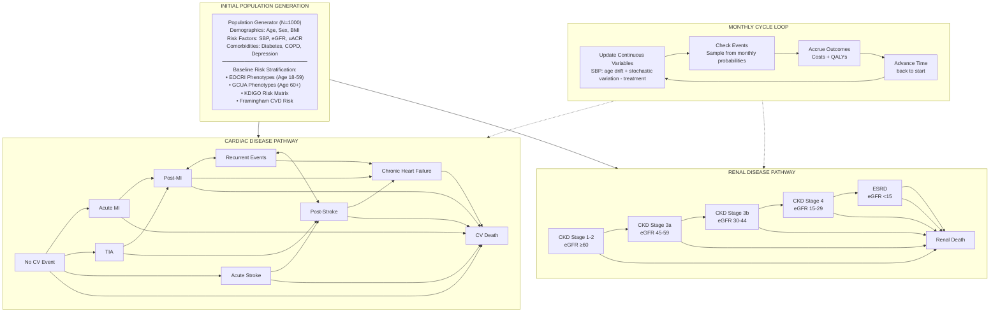

# IXA-001 Hypertension Cardiorenal Microsimulation Model
## State Transition Diagram Specification

**Purpose:** This document provides the complete specification for creating the model state transition diagram.

---

## Diagram Title
**Hypertension Cardiorenal Microsimulation Model - State Transition Diagram**

---

## Section 1: INITIAL POPULATION GENERATION

**Header:** INITIAL POPULATION GENERATION (blue banner)

**Content Box:** Population Generator (N=1000)

| Category | Parameters |
|----------|------------|
| **Demographics** | Age (40-85), Sex, BMI |
| **Risk Factors** | SBP (140-200 mmHg), eGFR (15-120 mL/min), uACR |
| **Comorbidities** | Diabetes (35%), COPD (17-32%), Depression (27-50%) |
| **Baseline Risk Stratification** | Dual-branch phenotyping (see below), KDIGO Risk Matrix, Framingham CVD Risk |

### Dual-Branch Phenotype Stratification

The model uses age-appropriate phenotype classification to capture different risk profiles:

| Phenotype Branch | Age Range | Full Name | Description |
|------------------|-----------|-----------|-------------|
| **EOCRI** | 18-59 years | Early-Onset CV Risk Indicators | Identifies younger patients with elevated CV risk due to early hypertension, metabolic syndrome, or familial factors |
| **GCUA** | 60+ years | Geriatric CV/CKD/Frailty Assessment | Captures age-related comorbidity burden, frailty, polypharmacy, and competing mortality risks |

#### EOCRI Phenotypes (Age 18-59)
- **Early-onset resistant HTN**: Resistant HTN diagnosed before age 50
- **Metabolic phenotype**: HTN with obesity, dyslipidemia, insulin resistance
- **Familial/genetic**: Strong family history of premature CVD
- **Secondary HTN causes**: PA, RAS, Pheo, OSA more prevalent in this group

#### GCUA Phenotypes (Age 60+)
- **Isolated systolic HTN**: Wide pulse pressure, arterial stiffness
- **Cardiorenal syndrome**: Combined HF and CKD
- **Frailty phenotype**: Reduced physiological reserve, falls risk
- **Polypharmacy risk**: Drug interactions, adherence challenges

---

## Section 2: CARDIAC DISEASE PATHWAY

**Header:** CARDIAC DISEASE PATHWAY (blue banner, left side)

### States and Colors

| State | Color | Type | Description |
|-------|-------|------|-------------|
| **No CV Event** | Green | Starting state | Patients without cardiovascular events |
| **Acute MI** | Orange | Acute event | Myocardial infarction |
| **TIA** | Orange | Acute event | Transient ischemic attack |
| **Acute Stroke** | Orange | Acute event | Ischemic/hemorrhagic stroke |
| **Post-MI** | Yellow | Chronic state | Post-myocardial infarction |
| **Recurrent Events** | Yellow | Chronic state | Multiple cardiovascular events |
| **Post-Stroke** | Yellow | Chronic state | Post-stroke state |
| **Chronic Heart Failure** | Yellow | Chronic state | Heart failure diagnosis |
| **CV Death** | Red/Orange | Absorbing state | Cardiovascular mortality |

### Transitions (Arrows)

```
No CV Event ──────────────┬──────────────┬──────────────┐
                          │              │              │
                          ▼              ▼              ▼
                      Acute MI         TIA       Acute Stroke
                          │              │              │
                          ▼              │              ▼
                       Post-MI ◄────────┴────────► Post-Stroke
                          │                            │
                          ├──────► Recurrent ◄────────┤
                          │        Events             │
                          │            │              │
                          ▼            ▼              ▼
                    ┌─────────────────────────────────┐
                    │     Chronic Heart Failure       │
                    └─────────────────────────────────┘
                                    │
                                    ▼
                    ┌─────────────────────────────────┐
                    │           CV Death              │
                    └─────────────────────────────────┘
```

**Key Transition Rules:**
- From No CV Event: Can transition to any acute event
- From Acute states: Transition to corresponding Post- states
- Post- states: Can have recurrent events or progress to CHF
- All cardiac states: Can transition to CV Death
- Bidirectional arrows between Post-MI, Recurrent Events, and Post-Stroke

---

## Section 3: RENAL DISEASE PATHWAY

**Header:** RENAL DISEASE PATHWAY (blue banner, right side)

### States and Colors

| State | eGFR Range | Color | Type |
|-------|------------|-------|------|
| **CKD Stage 1-2** | ≥60 mL/min | Green | Starting state |
| **CKD Stage 3a** | 45-59 mL/min | Yellow | Progression |
| **CKD Stage 3b** | 30-44 mL/min | Yellow | Progression |
| **CKD Stage 4** | 15-29 mL/min | Orange | Advanced |
| **ESRD** | <15 mL/min | Dark Red | End-stage |
| **Renal Death** | N/A | Red | Absorbing state |

### Transitions (Arrows)

```
┌─────────────────┐
│  CKD Stage 1-2  │
│    eGFR ≥60     │
└────────┬────────┘
         │
         ▼
┌─────────────────┐
│  CKD Stage 3a   │
│  eGFR 45-59     │
└────────┬────────┘
         │
         ▼
┌─────────────────┐
│  CKD Stage 3b   │
│  eGFR 30-44     │
└────────┬────────┘
         │
         ▼
┌─────────────────┐
│   CKD Stage 4   │
│  eGFR 15-29     │
└────────┬────────┘
         │
         ▼
┌─────────────────┐
│      ESRD       │
│    eGFR <15     │
└────────┬────────┘
         │
         ▼
┌─────────────────┐
│   Renal Death   │
└─────────────────┘
```

**Key Transition Rules:**
- Unidirectional progression (CKD does not reverse)
- Each stage can skip to Renal Death directly
- ESRD triggers dialysis costs

---

## Section 4: MONTHLY CYCLE LOOP

**Location:** Center of diagram, between cardiac and renal pathways

### Cycle Components (Circular Flow)

```
                    ┌─────────────────────────┐
                    │  Update Continuous      │
                    │     Variables           │
                    │ ───────────────────────│
                    │ SBP: age drift +        │
                    │ stochastic variation    │
                    │ - treatment             │
                    └───────────┬─────────────┘
                                │
    ┌───────────────────────────┼───────────────────────────┐
    │                           │                           │
    │                           ▼                           │
    │               ┌───────────────────────┐               │
    │               │                       │               │
    │               │    Monthly Cycle      │               │
    │               │       Loop            │               │
    │               │                       │               │
    │               └───────────────────────┘               │
    │                           │                           │
    ▼                           │                           ▼
┌─────────────┐                 │                ┌─────────────────┐
│  Advance    │                 │                │  Check Events   │
│   Time      │◄────────────────┴───────────────►│ ─────────────── │
│ ─────────── │                                  │ Sample from     │
│ back to     │                                  │ monthly         │
│ start       │                                  │ probabilities   │
└─────────────┘                                  └─────────────────┘
        ▲                                                │
        │                                                │
        │               ┌─────────────────────┐          │
        │               │  Accrue Outcomes    │          │
        └───────────────│ ─────────────────── │◄─────────┘
                        │ Costs (state +      │
                        │ event) + QALYs      │
                        │ (utilities)         │
                        └─────────────────────┘
```

### Cycle Steps

| Step | Name | Description |
|------|------|-------------|
| 1 | **Update Continuous Variables** | SBP: age drift + stochastic variation - treatment |
| 2 | **Check Events** | Sample from monthly probabilities |
| 3 | **Accrue Outcomes** | Costs (state + event) + QALYs (utilities) |
| 4 | **Advance Time** | Back to start |

---

## Section 5: KEY MODEL FEATURES

**Header:** KEY MODEL FEATURES (blue banner, bottom)

### Feature Boxes

| Feature | Description |
|---------|-------------|
| **TUNNEL STATES** | Post-event time tracking, Risk decay over time |
| **HISTORY ANALYSIS** | Patient trajectory, Event clustering, Adherence patterns |
| **RISK MODIFIERS** | Framingham × comorbidities, eGFR trajectory, Charlson score |

---

## Color Scheme

| Element | Color | Hex Code | Usage |
|---------|-------|----------|-------|
| Headers/Banners | Dark Blue | #1E5288 | Section headers |
| Starting States | Green | #90C050 | No CV Event, CKD 1-2 |
| Acute Events | Orange | #F5A623 | MI, TIA, Stroke acute |
| Chronic States | Yellow | #F8D347 | Post-event states, CKD 3a/3b |
| Advanced Disease | Dark Orange | #E07020 | CKD Stage 4 |
| End-Stage/Death | Red/Dark Red | #C0392B | ESRD, CV Death, Renal Death |
| Cycle Loop | Light Blue | #B8D4E8 | Monthly cycle components |
| Background | White | #FFFFFF | Main background |
| Borders | Dark Blue | #1E5288 | Outer frame |

---

## Layout Specifications

### Overall Dimensions
- **Aspect Ratio:** ~4:3 (landscape)
- **Recommended Size:** 1024 x 768 pixels or larger

### Section Positions

| Section | Position | Width | Height |
|---------|----------|-------|--------|
| Title | Top | 100% | 5% |
| Initial Population | Below title | 100% | 12% |
| Cardiac Pathway | Left | 35% | 55% |
| Monthly Cycle | Center | 30% | 55% |
| Renal Pathway | Right | 35% | 55% |
| Key Features | Bottom | 100% | 12% |

---

## Arrow Specifications

### Arrow Types

| Type | Style | Usage |
|------|-------|-------|
| **Standard Transition** | Solid, single-head | State-to-state progression |
| **Bidirectional** | Solid, double-head | Recurrent events |
| **Cycle Flow** | Curved, single-head | Monthly cycle loop |
| **Branch** | Solid with fork | Multiple possible transitions |

### Arrow Colors
- **Cardiac transitions:** Blue (#1E5288)
- **Renal progression:** Blue (#1E5288)
- **Cycle loop:** Dark blue (#1E5288)

---

## Text Specifications

| Element | Font Size | Font Weight | Alignment |
|---------|-----------|-------------|-----------|
| Main Title | 24pt | Bold | Center |
| Section Headers | 16pt | Bold | Center |
| State Names | 12pt | Bold | Center |
| State Descriptions | 10pt | Normal | Center |
| Cycle Labels | 10pt | Normal | Center |
| Feature Titles | 12pt | Bold | Center |
| Feature Descriptions | 9pt | Normal | Center |

---

## Notes for Image Creation

1. **Hierarchy:** Use visual weight to emphasize the dual-pathway structure
2. **Flow:** Ensure arrows clearly indicate direction of progression
3. **Balance:** Cardiac and renal pathways should be visually balanced
4. **Central Focus:** Monthly cycle loop connects both pathways
5. **Death States:** Visually distinguish absorbing states (CV Death, Renal Death)
6. **Color Gradient:** Green (healthy) → Yellow (moderate) → Orange (severe) → Red (terminal)

---

## Software Recommendations

| Tool | Best For |
|------|----------|
| **draw.io / diagrams.net** | Free, web-based, easy export |
| **Lucidchart** | Professional, collaborative |
| **Microsoft Visio** | Enterprise, detailed control |
| **PowerPoint** | Quick mockups, familiar interface |
| **Figma** | Design-focused, modern |
| **Mermaid.js** | Code-based diagrams |

---

## Mermaid.js Code (Simplified)



---

## Version History

| Version | Date | Changes |
|---------|------|---------|
| 1.0 | Feb 2026 | Initial specification |
| 1.1 | Feb 2026 | Added EOCRI and GCUA dual-branch phenotype stratification |

---

## Generated Diagram Files

| Layout | File | Format | Description |
|--------|------|--------|-------------|
| Vertical | `model_diagram_vertical.png` | PNG | Three-column layout (Cardiac \| Cycle \| Renal) |
| Vertical | `model_diagram_vertical_hires.png` | PNG (2x) | High-resolution version |
| Vertical | `model_diagram_vertical.svg` | SVG | Vector format for editing |
| Horizontal | `model_diagram_horizontal.png` | PNG | Spread layout |
| Horizontal | `model_diagram_horizontal_hires.png` | PNG (2x) | High-resolution version |
| Horizontal | `model_diagram_horizontal.svg` | SVG | Vector format for editing |

**Source Files:**
- `model_diagram_vertical.mmd` - Vertical layout Mermaid source
- `model_diagram_horizontal.mmd` - Horizontal layout Mermaid source

---

## References

- Model source code: `src/simulation.py`, `src/transitions.py`, `src/risk_assessment.py`
- Original diagram: `model_diagram.png`
- Documentation: `README.md`, `docs/treatment_effects_and_phenotypes.md`
